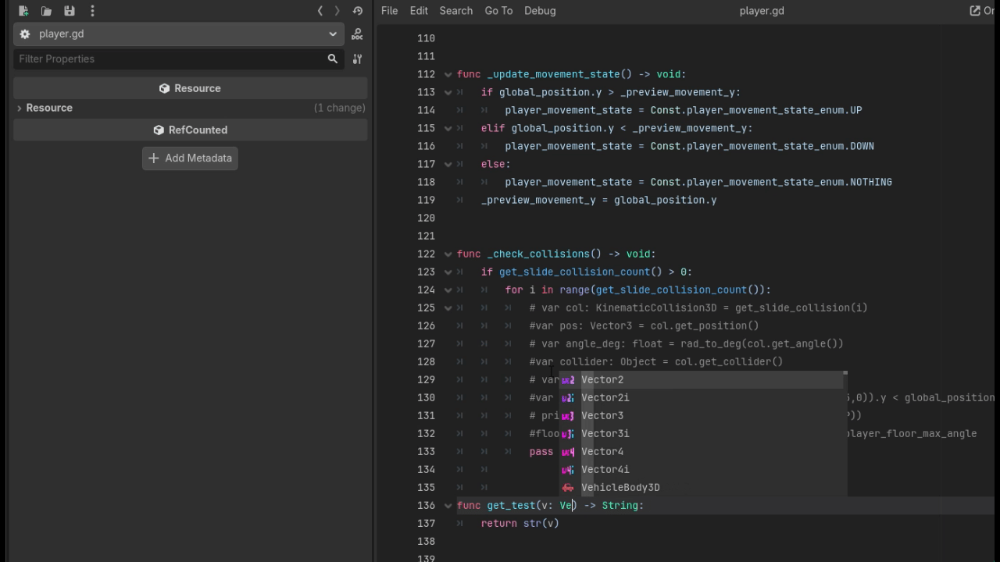

# ScreenDebug

A lightweight **runtime debug overlay** for Godot 4 that allows developers to **inspect properties** and **invoke safe methods** directly from the Inspector — without writing custom debug UI every time.

Designed to be **editor-friendly**, **safe for development**, and **self-disabling in release builds**.

---

## Features

- Display live values of properties (including nested ones like `velocity.x`)
- Call methods with **typed parameters** directly from the Inspector
- Supports multiple data types (int, float, bool, vectors, strings)
- Customizable font, colors, background, spacing, and layout
- Automatic formatting for floats and vectors
- Safe method execution with a configurable blocklist
- Automatically disables itself in **non-debug (release) builds** and warns the developer

---

## Installation

1. Copy the `screen_debug` folder into:
   ```
   res://addons/
   ```
2. Enable the plugin in:
   **Project → Project Settings → Plugins**
3. Add **ScreenDebug** as a node in your scene.

---

## Core Concept

ScreenDebug works by defining **what to inspect** and **what to call** using dictionaries in the Inspector.

- **Properties** → Read-only inspection
- **Methods** → Safe method calls with parameters

All configuration is done visually — no code changes required.

---

## Target Node

Set **`debug_target`** to the node you want to inspect.

Example:

- Player
- CharacterBody2D / CharacterBody3D
- Any custom Node

---

## Property Inspection

### Basic Property

```text
health
```

Inspector setup:

```text
Properties:
  Health → health
```

Output:

```text
Health: 100
```

---

### Nested Properties (using `/` or `:` semantics)

You can inspect **sub-properties** using Godot's indexed access.

```text
velocity:x
velocity:y
```

Inspector setup:

```text
Speed X → velocity:x
Speed Y → velocity:y
```

Output:

```text
Speed X: 120.00
Speed Y: -35.50
```

Works with:

- `Vector2`
- `Vector3`
- `Vector4`

---

### Examples

```text
position:x
position:y
transform:origin
scale
rotation
```

---

## Example Script (Target Node)

```gdscript
extends Node

func get_player_name() -> String:
    return "DebugHero"

func get_score() -> int:
    return 2450

func is_alive() -> bool:
    return true

func get_spawn_point() -> Vector2:
    return Vector2(15.25, 42.8)

func multiply(a: int, b: int) -> int:
    return a * b

func format_label(text: String, size: int) -> String:
    return "%s (%d)" % [text, size]
```

---

## Calling Methods — No Parameters

Inspector:

```text
Player Name → get_player_name
Score → get_score
Alive → is_alive
```

Output:

```text
Player Name: DebugHero
Score: 2450
Alive: true
```

---

## Calling Methods — One Parameter

Syntax:

```text
method/Type:value
```

Inspector:

```text
Label Test → format_label/String:Jump/int:0
```

Output:

```text
Label Test: Jump (0)
```

---

## Calling Methods — Two Parameters

Inspector:

```text
Multiply Test → multiply/int:6/int:7
```

Output:

```text
Multiply Test: 42
```

---

## Calling Methods — Vector Parameters

Passing vectors:

```text
Vector Example → some_method/Vector2:15.5,19.25
```

Supported vector formats:

```text
Vector2:x,y
Vector3:x,y,z
Vector4:x,y,z,w
```

---




---

## Supported Parameter Types

| Type    | Syntax Example             |
| ------- | -------------------------- |
| String  | `String:jump`              |
| int     | `int:10`                   |
| float   | `float:0.75`               |
| bool    | `bool:true` / `bool:false` |
| Vector2 | `Vector2:10,20`            |
| Vector3 | `Vector3:1,2,3`            |
| Vector4 | `Vector4:1,2,3,4`          |

---

## Float & Vector Formatting

You can control numeric formatting via:

- `floats_decimal_places`
- `floats_vector_places`

Example:

```text
Vector2(15.33, 19.00)
```

---

## Method Safety

Blocked by default:

```gdscript
queue_free
add_child
set_process
move_and_slide
```

You can extend or customize this list using:

```gdscript
not_allowed_methods
```

---

## Release Build Protection

In **non-debug builds**, ScreenDebug:

- Disables `_process` and `_physics_process`
- Hides itself automatically
- Logs a warning:

```text
ScreenDebug detected in RELEASE build. Remove it before publishing the game.
```

This prevents accidental shipping of debug tools.

---

## Recommended Use Cases

- Debugging player state
- AI inspection
- Physics values visualization
- Rapid iteration during gameplay tuning
- QA & testing builds

---

## Final Notes

ScreenDebug is meant to be:

- **Non-intrusive**
- **Safe by default**
- **Extremely flexible**

Use it heavily during development — and let it protect you in production.

Happy debugging!

---

## ❤️ Support

### If this project helped you, please consider supporting it:

Github Sponsors: https://github.com/sponsors/Saulo-de-Souza

Paypal: https://www.paypal.com/donate/?hosted_button_id=G24W4KL9ALH64
